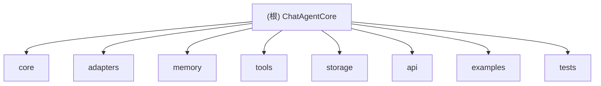

# ChatAgentCore

> 聊天机器人核心项目 - AI 驱动的对话系统基础设施

## 项目愿景

ChatAgentCore 致力于构建一个高性能、可扩展的聊天机器人核心框架，支持现代 AI 对话系统的快速开发和部署。

项目目标：
- 提供模块化的对话管理组件
- 支持多 LLM 提供商集成
- 实现可插拔的消息处理管道
- 提供上下文管理和状态持久化
- 支持多轮对话和复杂推理场景

## 架构总览

> 当前项目处于初始化阶段，架构设计待完善

建议的模块结构：
```
chatagentcore/
├── core/              # 核心对话引擎
├── adapters/          # LLM 适配器层
├── memory/            # 上下文和记忆管理
├── tools/             # 工具函数和插件
├── storage/           # 持久化存储
├── api/               # 外部接口
├── examples/          # 使用示例
└── tests/             # 测试套件
```

## 模块结构图



## 模块索引

| 模块路径 | 状态 | 职责描述 |
|----------|------|----------|
| `core/` | 待创建 | 对话引擎、消息路由、会话管理 |
| `adapters/` | 待创建 | LLM 提供商适配（OpenAI, Anthropic, Claude 等） |
| `memory/` | 待创建 | 上下文存储、对话历史、RAG 检索 |
| `tools/` | 待创建 | 工具调用、插件系统、函数代理 |
| `storage/` | 待创建 | 数据模型、数据库访问层 |
| `api/` | 待创建 | REST/WebSocket 接口、SDK |
| `examples/` | 待创建 | 使用示例和演示应用 |
| `tests/` | 待创建 | 单元测试、集成测试、端到端测试 |

## 运行与开发

### 环境要求

```bash
# 推荐开发环境
- Python 3.10+ 或 Node.js 18+
- Git
- Docker (可选，用于容器化部署)
```

### 快速开始

```bash
# 克隆仓库
git clone https://github.com/your-org/chatagentcore.git
cd chatagentcore

# 安装依赖 (选择你的语言栈)
# Python
pip install -e .

# Node.js
npm install

# 运行测试
pytest              # Python
npm test            # Node.js
```

## 测试策略

- 单元测试：覆盖率目标 80%+
- 集成测试：关键流程验证
- 端到端测试：模拟真实对话场景
- 性能测试：并发和响应时间验证

## 编码规范

- 代码风格：遵循语言社区标准 (PEP 8 / ESLint)
- 文档：所有公共 API 必须包含文档字符串
- 类型检查：启用强类型检查 (TypeScript / mypy)
- 提交信息：遵循 Conventional Commits 规范

## AI 使用指引

### 项目初始化待办事项

1. 选择技术栈并初始化项目
   - [ ] Python + FastAPI/Flask
   - [ ] Node.js + Express/Fastify
   - [ ] Go + Gin
   - [ ] 其他

2. 创建基础目录结构

3. 初始化依赖管理
   - [ ] `pyproject.toml` 或 `package.json`
   - [ ] 开发依赖 (linting, testing, formatting)

4. 配置开发工具
   - [ ] `.editorconfig`
   - [ ] `.prettierrc` / `ruff.toml`
   - [ ] `.gitignore`

5. 设置 CI/CD
   - [ ] GitHub Actions / GitLab CI
   - [ ] 自动化测试
   - [ ] 代码质量检查

## 相关资源

- 许可证: Apache License 2.0
- Issues: [GitHub Issues](https://github.com/your-org/chatagentcore/issues)
- Discussions: [GitHub Discussions](https://github.com/your-org/chatagentcore/discussions)

## 变更记录 (Changelog)

### 2026-02-04
- 初始化项目仓库
- 添加基本文档和许可证
- 创建 CLAUDE.md 架构文档
